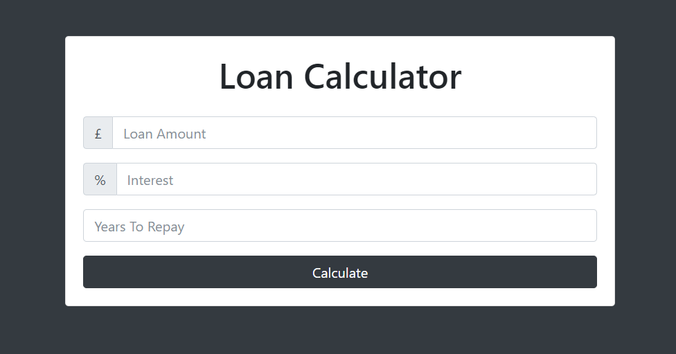

<h1 align="center">Loan Calculator</h1>

# Project Description

This is a simple loan calculator web application that allows users to input loan amount, interest rate, and loan term in years, and calculates the monthly payment, total payment, and total interest.

Built With

- Vanilla JavaScript
- CSS
- HTML

## How it works

- There's no specific installation process required for this web application. You can simply download the files and open the index.html file in your web browser.

## Code Structure

- index.html: HTML file containing the structure of the web page.
- style.css: CSS file containing styles for the web page.
- script.js: JavaScript file containing the logic for the loan calculator.

## 🤝 Support

Give a ⭐️ if you like this project!
